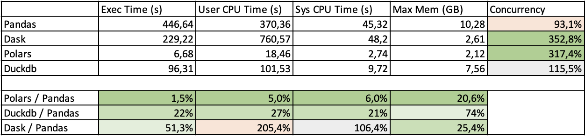
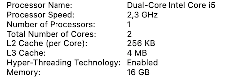

# Python Dataframe libraries comparison

*Avoiding the word benchmark here since the work is not following any strict
methodology*

## TL;DR



Polars is an **underrated** library that should be considered as an
alternative to Numpy / Pandas stack. A shift to [Apache
Arrow](https://arrow.apache.org) format in Machine Learning libraries APIs
would be a nice move to improve interoperability and efficiency.

## Context and approach

Pandas library is the "defacto" choice for any data engineer / scientist when
building data projects in Python. It is relying on Numpy Array structure which
is the data API format for, almost, all Data Science libraries.

Many limitations linked to that library are leading the community to explore
alternatives or complementary setups. Some of them are Pandas based (mainly
scaling out workloads). Others have started from the ground up and leveraging
new approaches (Column structures / SIMD parallel processing). Apache Arrow
format is the most common one and many new libraries are building on top of it.

In order to explore and evaluate those new alternatives, this repository is
providing :
- A comparison of few libraries on a typical workload
- An **extensible** setup to add **new libraries** and test **other workloads**

Few utils to download data and lint the code are provided as
[just](https://just.systems) recipes


Few env variables need to be set (as in [here](./.envrc))

### Compared libraries

- [Pandas](https://pandas.pydata.org)
- [Polars](https://www.pola.rs): Apache Arrow based / Implemented in Rust /
Non distributed
- [Dask](https://www.dask.org): Pandas based / Distributed

### Dataset

Set of public CSV files logging all real estate transactions in France. Data
is provided in one file per year and depth is limited to 5 years (please note
that the results are based on a deeper history)


### Job description

The objective is to list zipcodes with most and least transactions number
during all the period (9 years in my case). Dask approach is different in the
implementation (not a full sort of the result)


### How to run

```
$ just data-dl-all
$ poetry install
$ ./main.py pandas top-flop "*"
$ ./main.py dask top-flop "*"
$ ./main.py polars top-flop "*"
```

## Results

The tests have been executed on a Macbook Pro with the following configuration



### Pandas


### Dask


### Polars


## Conclusions

Polars is REALLY REALLY REALLY fast and worth try for most data processing
activities
- Its streaming (lazy files loading) approach makes it possible to handle
large amount of data without being quickly limited by the available memory size
- It is multi-threaded and performing well on multi core machines

Dask is improving the parallelism of Pandas but :
- This comes with an overcost (+100% in our case)
- Memory usage is widely improved using Dask (lazy data loading / piping
mechanisms)
- No full sort has been performed (only head and tail)
- A joint [initiative](https://github.com/pola-rs/dask-polars) is working on
getting best of both.

## Future actions

- Add other alternatives to the comparison
    - [Spark](https://spark.apache.org/docs/latest/api/python/)
    - [Datafusion](https://arrow.apache.org/datafusion/)
    - [Duckdb](https://duckdb.org)
- Add different workloads to confirm the conclusions
- Make more analysis to deeply understand the why